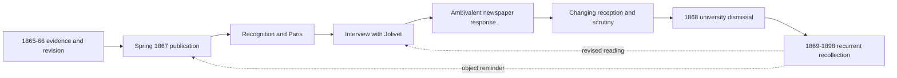

# E25 identity formation and causal trace

**Scope:** A researcher-facing graph for thirty fictional first-person recollections. Records reside in [the cohort](../batches/v11/Pretorius_v11_E25_30_Events.jsonl); the source [scientific memoir](Pretorius_1867_On_the_Seat_of_the_Soul.md) and [newspaper](Pretorius_Jolivet_1867_French_Original.txt) remain distinct artifacts. This is a hypothesis-rich association map, not an experimentally measured neural connectome.

## Arc spine

## Episodic segments

**Preparing the question, E25-001 to E25-004 (1865-1866):** *The Question Beneath the Twitch*, *The Margin Too Narrow*, *A Man Carrying His Hat*, *Two Temperatures*. Early pride in professional discrimination is compatible with externally supplied correction.

**A book of results, E25-005 to E25-009 (February-July 1867):** *The Drawer I Kept Locked*, *The Editor's Necessary Knife*, *The Signed Offprint*, *Two Contrary Letters*, *A Place Card in Munich*. Science and secrecy begin occupying different parts of his public account. His pleasure in being read is a distinct reward from experimental progress.

**Paris and the interview, E25-010 to E25-014 (August 1867):** *The City with No Obligations*, *The Objection Worth Keeping*, *The Correspondent's Hand*, *What Belongs to the Maker*, *A Sentence I Could Not Correct*. Attraction to attentive intelligence is plausible in the context of Theodor Vahl, but Jolivet is an independent journalist and gives no promise of personal interest.

**Early cascade, E25-015 to E25-020 (September 1867-July 1868):** *The Correction Which Was Not an Apology*, *The Invitation Withdrawn*, *The Rumour Finds a Vocabulary*, *Good Company without a Defence*, *The Newspaper on the Committee's Table*, *The Sentence with Other Causes*. The article changes how suspicions are interpreted. The institution's charges also depend on practical laboratory matters and Pretorius's refusal to submit to independent oversight.

**Thirty years of competing recall, E25-021 to E25-030 (1868-1898):** *The Article beside the Window*, *No Letter Sent to Paris*, *Mathilde's Shorter Sentence*, *The Catalogue's Wrong Title*, *The Widow's Unasked Question*, *The Margin Which Voss Would Not Close*, *Kappel's Inscribed Copy*, *Anna's Uncomfortable Standard*, *The Rays Which Showed No Soul*, *The Page I No Longer Folded Away*. Each later episode changes the meaning of a present cue or earlier claim without deleting the original.

## Belief states that coexist, not one linear moral

**At publication:** Competence deserves recognition; cautious methods and great speculation are compatible. **At the interview:** A sympathetic listener has recognized his brilliance; clever replies seem to settle ethical questions. **Upon publication:** Accurate quotations can still be an injury, but he values the attention. **During dismissal:** The interviewer is blamed too readily for an institutional collapse with independent causes. **During exile:** Unsent letters and counterfactual conversations show unresolved affiliation and embarrassment. **With Mathilde and Voss:** The reporter's objections become useful only when different readers can ask them without becoming enemies. **Late:** The paper preserves real joy, valuable scholarship and a humiliation that is no longer a complete biography.

## Retrieval and behavioral hypothesis

A physical clipping, ink-smell, coffee cup, printed offprint, or phrase about ownership should not point to one unchanging story. It can activate competing events with varying temporal distance, affect, relationships and alternatives. Test the later subject's conduct toward being interviewed, transparency of experimental methods, willingness to admit a critic to a lab, and boundaries around another being's welfare. Distinguish memory recall accuracy from changes in action choice. A retrieval-only baseline, a shuffled-link control, and a no-imprint baseline are necessary for evaluating any future neural mechanism.
